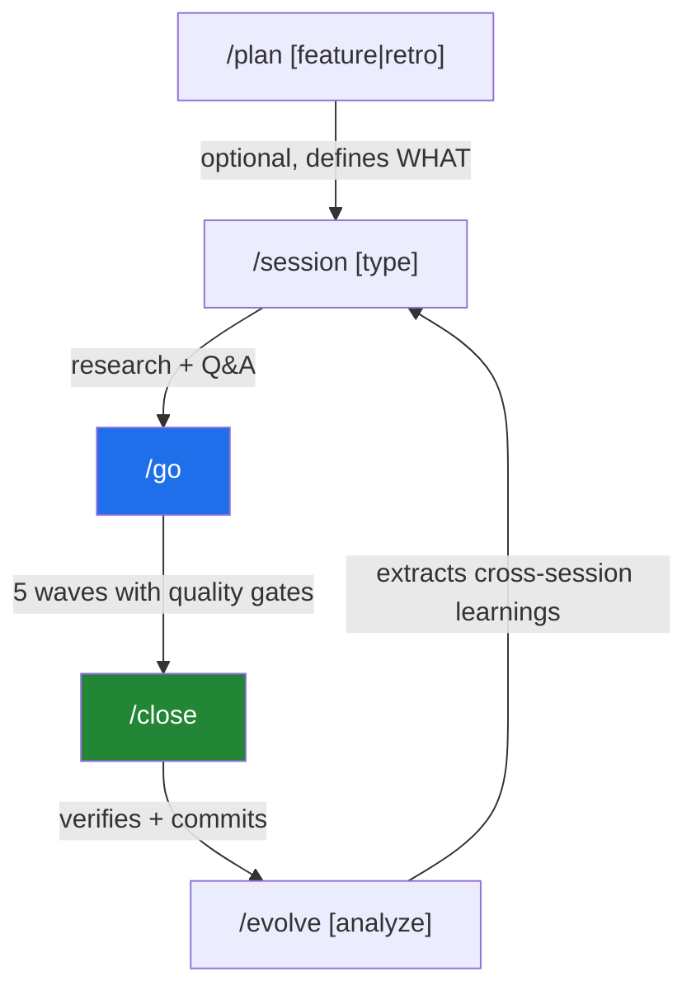
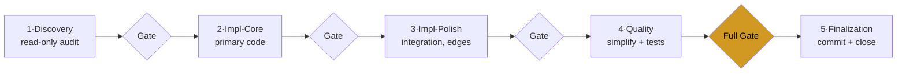
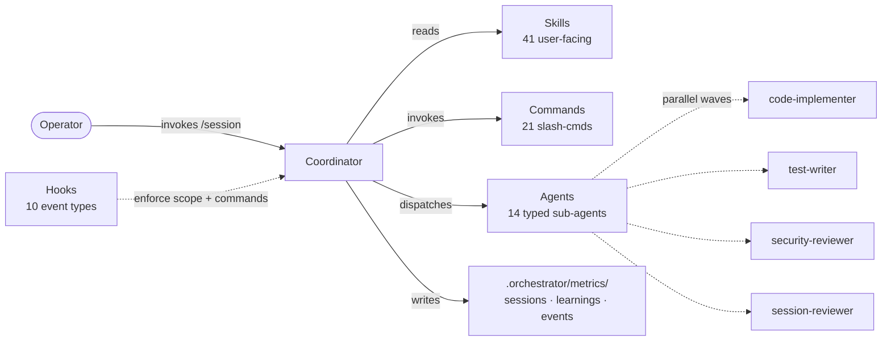

# Session Orchestrator

[](LICENSE)
[](CHANGELOG.md)
[](#development)
[](https://docs.anthropic.com/en/docs/claude-code)
[](https://developers.openai.com/codex/)
[](https://cursor.com)
[](https://pi.dev/docs/latest)

Turn ad-hoc Claude Code sessions into a repeatable loop with verification gates — **loop engineering** for software work. You design the loop (`research → plan → execute in waves → close`); Session Orchestrator runs it on top of your existing agent across Claude Code, Codex CLI, Cursor IDE, and Pi, with the guards, telemetry, and cross-session memory that keep a long agent run honest. Inter-wave reviews catch regressions before they ship; carryover issues mean nothing slips through.

Community plugin (MIT, not affiliated with Anthropic) for solo devs and small teams using Claude Code, Codex CLI, Cursor, or Pi.

## Install

> **Prerequisite:** Node.js 24 or later. Check with `node --version`. v3.x runs as ES modules and requires a real Node runtime, no Bash shim. [Install Node.js](https://nodejs.org/).

### Claude Code

Run these two slash commands **inside** Claude Code (they are not shell commands):

```text
/plugin marketplace add Kanevry/session-orchestrator
/plugin install session-orchestrator@kanevry
```

Then install Node dependencies **once** (hooks import `zx`):

```bash
cd "$(claude plugin dir session-orchestrator 2>/dev/null || echo ~/.claude/plugins/session-orchestrator)"
npm install
```

Restart Claude Code so the slash commands become available.

### Codex CLI

```bash
git clone https://github.com/Kanevry/session-orchestrator.git ~/Projects/session-orchestrator
cd ~/Projects/session-orchestrator
npm install
node scripts/codex-install.mjs
```

### Cursor IDE

```bash
git clone https://github.com/Kanevry/session-orchestrator.git ~/Projects/session-orchestrator
cd ~/Projects/session-orchestrator
npm install
node scripts/cursor-install.mjs /path/to/your/project
# Session Config goes in CLAUDE.md (Cursor reads CLAUDE.md natively)
```

### Pi

```bash
npm install -g --ignore-scripts @earendil-works/pi-coding-agent
git clone https://github.com/Kanevry/session-orchestrator.git ~/Projects/session-orchestrator
cd ~/Projects/session-orchestrator
npm install
node scripts/pi-install.mjs /path/to/your/project --settings-only
# Or use Pi's package installer directly:
# pi install ~/Projects/session-orchestrator -l
```

Setup guides: [Codex](docs/codex-setup.md), [Cursor IDE](docs/cursor-setup.md), and [Pi](docs/pi-setup.md). Per-IDE setup notes for `CLAUDE.md` vs `AGENTS.md`: [skills/_shared/instruction-file-resolution.md](skills/_shared/instruction-file-resolution.md).

## Quick Start

Add a `## Session Config` section to your project's `CLAUDE.md` (or `AGENTS.md` on Codex CLI / Pi), then run three commands:

```text
/session feature
/go
/close
```

The smallest valid Session Config is seven fields:

```yaml
## Session Config

test-command: npm test
typecheck-command: npm run typecheck
lint-command: npm run lint
agents-per-wave: 6
waves: 5
persistence: true
enforcement: warn
```

Everything else is opt-in. See [`docs/session-config-template.md`](docs/session-config-template.md) for the full template and [`docs/session-config-reference.md`](docs/session-config-reference.md) for the canonical type and default reference.

## Support & expectations

Session Orchestrator is MIT-licensed and provided **as-is, with no SLA**. It is a community project, **not an official Anthropic product**.

- Questions, ideas, show-and-tell → [GitHub Discussions](https://github.com/Kanevry/session-orchestrator/discussions).
- Bugs and feature requests → [Issues](https://github.com/Kanevry/session-orchestrator/issues).

There is no commercial support contract or guaranteed response time; maintenance happens on a best-effort basis.

## What this is NOT

- **Not an official Anthropic product.** Not affiliated with or endorsed by Anthropic.
- **Not a replacement for Claude Code** (or Codex CLI / Cursor / Pi). It is a workflow layer that runs *on top of* your existing agent — you still need one of those tools installed.
- **Not a hosted service.** Everything runs locally as plain Markdown plus a thin Node runtime; there is no server, account, or cloud component.
- **No guarantee that telemetry numbers transfer to your repo.** Reported test counts and metrics describe this repository under its own conditions — see [`docs/telemetry/telemetry-claims.md`](docs/telemetry/telemetry-claims.md). Your results will vary by stack, project size, and configuration.

## What you get

- **41 skills** for the session lifecycle (start, plan, execute, close, evolve), discovery, vault sync, MCP authoring, debugging, brainstorming, plan grilling, persona panels, cross-repo dispatch, harness/repo audits, tmux visualization, and more
- **21 slash commands** (`/session`, `/go`, `/close`, `/discovery`, `/plan`, `/grill`, `/evolve`, `/autopilot`, `/dispatcher`, `/test`, `/brainstorm`, `/debug`, `/persona-panel`, `/memory-cleanup`, …)
- **14 typed sub-agents** (code-implementer, test-writer, security-reviewer, session-reviewer, qa-strategist, architect-reviewer, dialectic-deriver, memory-proposal-collector, skill-applied-judge, …)
- **10 hook event types** (handlers under `hooks/`) enforcing scope, blocking destructive commands, gating templates-first, auditing memory proposals, capturing telemetry
- **9996 vitest tests** passing on every commit ([telemetry methodology](docs/telemetry/telemetry-claims.md)), validate-plugin 141/141, typecheck OK, lint 0

## Lifecycle at a glance



`/plan` is optional. You can create issues manually and jump straight to `/session`. `/evolve` runs deliberately after 5+ sessions, not automatically.

## How it works

Most agentic-coding tools jump straight into writing code. Session Orchestrator adds a structured loop on top: research first, agree on scope, then execute in five typed waves with verification gates between them.



Here is what happens when you type `/session feature`:

1. **Phase analysis runs in parallel.** Git state, open issues, recent commits, SSOT freshness, plugin freshness, resource health, prior-session memory, and project-intelligence learnings all get inspected. The result is a structured Session Overview with a recommendation, not a wall of raw data.
2. **You agree on scope.** Through a tool-rendered picker (Claude Code) or a numbered list (Codex CLI / Cursor / Pi), you pick which issues to tackle. The orchestrator has an opinion and tells you what it would do.
3. **The plan is decomposed into five waves.** Discovery (read-only), Impl-Core, Impl-Polish, Quality, and Finalize. Agent counts per role scale by session type. Each wave has a defined purpose and a deliverable.
4. **`/go` executes.** Agents work in parallel within a wave. A session-reviewer audits the output between waves on eight dimensions: implementation correctness, test coverage, TypeScript health, OWASP, issue tracking, silent failures, test depth, type design. Only findings with confidence at or above 80 reach you.
5. **`/close` ships it.** Every planned item is verified. Quality gates run full. Unfinished work becomes carryover issues so nothing falls through the cracks. Files are staged individually, not via `git add .`, so parallel sessions cannot stomp each other.

Two complementary commands round out the loop:

- **`/plan`** runs *before* a session, when you need a PRD, requirements, or a retrospective.
- **`/evolve`** runs occasionally, deliberately. It analyses session history across runs, surfaces patterns that only emerge over time, and feeds them back as Project Intelligence at the next session-start.

The system is markdown-driven config plus a thin Node runtime. Skills, commands, and agents are Markdown with YAML frontmatter; the runtime under `scripts/lib/*.mjs` and `hooks/*.mjs` handles dispatch, hooks, validation, and telemetry. Everything is plain text — if something goes wrong, you can read every file and see what happened.

## Why this design

**Five typed waves, not one big batch.** Discovery first, so the implementer agents start with shared context. Impl-Core before Impl-Polish, so the architectural decisions land before the integrations. Quality runs a *simplification pass* on AI-generated code before tests are written, otherwise tests pin the AI patterns into place.

**Inter-wave reviews, not just end-of-session.** A session-reviewer agent runs between every wave with explicit confidence scoring on eight dimensions. Only findings at or above confidence 80 surface — this filters speculative criticism and keeps your attention on what matters.

**State persists across crashes.** `STATE.md` records wave progress, mission status, and deviations. If the session is interrupted, the next `/session` invocation offers to resume from the last completed wave. Coordinator snapshots (git refs under `refs/so-snapshots/*`) capture the working tree on demand.

**Hooks enforce, not just warn.** Pre-Bash destructive-command guard blocks `git reset --hard`, `rm -rf`, force-pushes, and ten more rules from `.orchestrator/policy/blocked-commands.json`. Pre-Edit scope enforcement blocks writes outside an agent's `allowedPaths`. The guard runs in main sessions and subagent waves equally.

**Cross-session learning is opt-in and inspectable.** Every session writes a record to `.orchestrator/metrics/sessions.jsonl`. After 5+ sessions, `/evolve analyze` extracts confidence-scored patterns into `learnings.jsonl`. You can read every line, prune via `/evolve review`. Nothing is hidden.

**VCS dual support, no lock-in.** Auto-detects GitLab or GitHub from your git remote. Full lifecycle for both: issue management, MR/PR tracking, pipeline status, label taxonomy, milestone queries.

## What's new (v3.7.0 → v3.9.0)

Test suite grew to **9996 passing** on every commit. Zero breaking changes — every release is additive and backward-compatible (claude/codex/cursor/pi behaviour unchanged across each bump). Headlines:

- **Pi harness adapter (v3.9.0, #639)** — Session Orchestrator now runs under [earendil-works/pi](https://pi.dev) like Codex and Cursor: `pi/` prompt-wrapper surface, a Pi native-hook bridge, `scripts/pi-install.mjs`, and `hooks/hooks-pi.json`. Platform/config/state resolution recognise the `.pi` marker dir + `PI_*` env vars — additive, no change to the other three runtimes.
- **Cross-repo vault-status board + free-repo dispatcher (Epic #673, on `main`)** — a live `_active-sessions.md` board in your vault shows which repos have a session in flight; `/dispatcher` enumerates candidate repos below a confinement root, ranks the FREE ones by backlog × staleness × readiness, recommends one, and claims its lease atomically. Dispatcher-autonomy is config-gated and **fail-closed / off by default** (a suitability verdict must pass before any autonomous launch).
- **Skill-evolution autonomy (Epic #643)** — opt-in self-evolution gate: the engine may auto-apply only the `command-count` drift shape on the root instruction file, behind a quadruple gate (autonomy ∧ safe-posture ∧ gate-green ∧ evidence-floor). Plugin / local-skill / remote targets are always MR-only.
- **Parallel-session detection hardening (Epic #583, v3.8.0)** — mechanical `session.lock` acquisition on every `SessionStart`, heartbeat-based liveness (replacing fragile PID-liveness), semantic session ids (`<branch>-<date>-<mode>-<n>`), and a STATE.md peer-guard — so two concurrent sessions in one repo can no longer stomp each other's wave state.
- **Native-autonomy ADR-0010 + `/loop` anchoring (v3.9.0, #633)** — per-primitive verdicts for Claude Code's autonomy family (`/loop` = Adopt, `/goal` = Adapter, `/batch` = Stay, `/background` = Adapter), a vendorable `templates/_shared/loop.md` baseline, and the always-on `loop-and-monitor.md` routing rule.
- **GitHub public-safety + green CI (v3.8.0)** — restored a clean public mirror: dropped the never-green `windows-latest` leg (the orchestrator is POSIX-first), extended the owner-leakage scanner (full RFC1918 detection + dash-encoded-path P9), and removed committed session-exhaust artifacts.
- **agent-status side-channel + sunset-review (v3.9.0, #565, #444)** — a lean per-agent status push helper (cross-process-race-tested) and a read-only surface walker that classifies the skill/agent/command inventory into Active / Investigate / Demote / Retire.
- **Host-local privacy-clean paths (#653)** — vault-dir and baseline-path now resolve `env > owner.yaml > committed default`, so a machine can point the plugin at host-local paths without ever committing a personal home path.
- **CI vitest suite sharded 3-way (on `main`)** — the GitLab `test` job now runs as 3 parallel `--shard` legs (per-shard JSON, `--min-tests` floor) to fix a shared-runner hang, plus an additive `--log` in-flight diagnostic on the fail-closed `assert-vitest-green.mjs` verifier and watchdog hardening (per-spawn timeout + teardown SIGKILL; one busy-wait→async-poll) across 6 cross-process integration child-spawn helpers.
- **Frontend-slop detection hook (Epic #684 P1, on `main`)** — a new opt-in `PostToolUse` hook flags AI frontend slop after UI-file edits (default-off, warn-only, non-blocking, profile-gated — mirrors `loop-guard`), backed by `<!-- rule:<id> -->` markers in `.claude/rules/frontend.md` (Absolute Bans / Motion / Layout) and the `frontend-slop-hook:` Session Config key.

For the full version history see [CHANGELOG.md](CHANGELOG.md). For previous releases: v3.7.0 (2026-05-23), v3.6.0 (2026-05-14), v3.5.0 (2026-05-09), v3.4.0 (2026-05-08).

### Claude Code 2.1.x adoption matrix (condensed)

| Area | Features adopted | Issue |
|---|---|---|
| Hooks & telemetry | `experimental.monitors` plugin manifest; `hookSpecificOutput.additionalContext` on 4 PostToolUse hooks; `terminalSequence` (OSC 9 + OSC 777); `worktree.bgIsolation: "none"` | #427, #428, #429, #431 |
| Commands & skills | `disable-model-invocation: true` on 12 USER-ONLY commands; skill descriptions ≤ 1024 chars + trigger phrases verified across 41/41 | #430, #432 |
| Routing | `model:` frontmatter routing on 41 SKILL.md (opus / sonnet / haiku / inherit); `Skill(name:*)` permission wildcards on 5 worker agents | #434, #435 |
| Validation | `$schema` validation (schemastore.org) on both manifests + CI gate | #433 |

Full table and follow-ups in `CLAUDE.md` (or `AGENTS.md` on Codex CLI / Pi) and CHANGELOG.md.

## Repository anatomy



## Components

**Skills (41 user-facing).** Lifecycle: `session-start`, `session-plan`, `wave-executor`, `session-end`, `quality-gates`, `using-orchestrator`. Authoring: `skill-creator`, `mcp-builder`, `hook-development`, `frontmatter-guard`. Planning & discovery: `plan`, `discovery`, `repo-audit`, `brainstorm`, `write-executable-plan`, `debug`, `claude-md-drift-check`, `grill`. Architecture: `architecture`, `domain-model`, `ubiquitous-language`. Cross-session: `evolve`, `convergence-monitoring`, `memory-cleanup`, `sunset-review`. Vault & docs: `vault-sync`, `vault-mirror`, `daily`, `docs-orchestrator`. Ecosystem: `bootstrap`, `gitlab-ops`, `gitlab-portfolio`, `ecosystem-health`, `mode-selector`, `autopilot`, `dispatcher`. Testing: `test-runner`, `playwright-driver`, `peekaboo-driver`. Content review: `persona-panel`. Visualization: `tmux-layout` (opt-in, operator side-channel — ADR-0007).

**Commands (21).** `/session`, `/go`, `/close`, `/discovery`, `/plan`, `/evolve`, `/bootstrap`, `/harness-audit`, `/autopilot`, `/autopilot-multi`, `/repo-audit`, `/test`, `/memory-cleanup`, `/portfolio`, `/brainstorm`, `/debug`, `/persona-panel`, `/grill`, `/sunset-review`, `/templates-ack`, `/dispatcher`.

**Agents (14 typed sub-agents).** `code-implementer`, `test-writer`, `ui-developer`, `db-specialist`, `security-reviewer`, `session-reviewer`, `docs-writer`, `architect-reviewer`, `qa-strategist`, `analyst`, `ux-evaluator`, `dialectic-deriver`, `memory-proposal-collector`, `skill-applied-judge`.

**Hook event types (10).** `SessionStart` (banner + init), `SessionEnd` (close events), `PreToolUse/Edit|Write` (scope enforcement), `PreToolUse/Bash` (destructive-command guard + enforce-commands + templates-first + staging-fence + memory-propose audit), `PostToolUse` (edit validation + opt-in frontend-slop detection + loop-guard), `Stop` (session events), `SubagentStop` (telemetry), `PostToolUseFailure` (corrective context), `PostToolBatch` (wave signal + operator-steer), `SubagentStart` (telemetry), `CwdChanged` (cwd-change record). Plus the Clank Event Bus integration in `hooks/_lib/events.mjs`.

**Output Styles.** 3 (`session-report`, `wave-summary`, `finding-report`) for consistent reporting.

**Policy & rules.** `.orchestrator/policy/blocked-commands.json` (13 destructive-command rules); `.claude/rules/parallel-sessions.md` (PSA-001..PSA-004).

**Codex.** `.codex-plugin/plugin.json` (manifest), compatibility config, 3 agent role definitions, marketplace `composerIcon`.

**Pi.** `package.json` `pi` manifest, `pi/extensions/session-orchestrator.ts` bridge, `hooks/hooks-pi.json`, and `scripts/pi-install.mjs`.

**Scripts.** Deterministic CLI tools (parse-config, run-quality-gate, validate-wave-scope, validate-plugin, token-audit, autopilot, autopilot-multi) plus migration helpers (`vault-consolidate.mjs` — vault folding [#499](https://github.com/Kanevry/session-orchestrator/issues/499); `migrate-vault-paths.mjs` — username-drift path repair [#499]; `migrate-cold-start-seed.mjs` — seeds welcome-banner markers in dormant repos [#507](https://github.com/Kanevry/session-orchestrator/issues/507)) plus shared lib (`scripts/lib/*.mjs`) plus a vitest suite of 10008+ tests.

### `/harness-audit` — Anthropic large-codebase rubric

`scripts/harness-audit.mjs` runs **8 deterministic categories / 33 checks** (rubric `2026-06`) over a repo and emits `.orchestrator/metrics/audit.jsonl`. Category 8 ("Large-Codebase Readiness") operationalises Anthropic's [Claude Code large-codebase best-practices](https://claude.com/blog/how-claude-code-works-in-large-codebases-best-practices-and-where-to-start) checklist — layered `CLAUDE.md` (or `AGENTS.md` on Codex CLI / Pi), codebase-map presence, LSP/code-intelligence wiring, scoped test/lint commands, `permissions.deny`, and root-file structural leanness — as scored signals you can run on yourself and on consumer repos. The checks are intentionally orthogonal to repo-audit's baseline-compliance pass/fail (`skills/repo-audit/SKILL.md`); both surfaces ship.

## Comparison

| Capability | Session Orchestrator | Manual `CLAUDE.md` | Other orchestrators |
|---|---|---|---|
| Session lifecycle (start → plan → execute → close) | Full, automated | Manual | Partial |
| Typed waves with quality gates | 5 roles, progressive verification | None | Batch execution |
| Session persistence and crash recovery | `STATE.md` plus memory files | None | Partial |
| Scope and command enforcement hooks | PreToolUse with strict / warn / off | None | None |
| Circuit breaker and spiral detection | Per-agent, with recovery | None | Partial |
| Cross-session learning | Confidence-scored learnings | None | None |
| Adaptive wave sizing | Complexity-scored, dynamic | Fixed | Fixed |
| VCS integration (GitLab + GitHub) | Dual, auto-detected | Manual CLI | Usually GitHub only |
| Design-code alignment | Pencil integration | None | None |
| Session close with carryover | Verified, with issue creation | Manual | Partial |

The design goal is engineering quality. Every wave exits verified, every unfinished issue gets a carryover ticket, every session closes with a clean commit.

### vs. maestro-orchestrate

Both [`maestro-orchestrate`](https://github.com/josstei/maestro-orchestrate) and session-orchestrator coordinate multi-agent work in long-running AI coding sessions. They differ in scope and execution model:

| Axis | session-orchestrator | maestro-orchestrate |
|---|---|---|
| Execution model | 5 typed waves (Discovery → Impl-Core → Impl-Polish → Quality → Finalization) with inter-wave quality gates and confidence-scored session-reviewer | 4-phase sequential model with parallel subagents |
| Runtime coverage | Claude Code + Codex CLI + Cursor IDE + Pi (4) | Gemini CLI + Claude Code + Codex + Qwen Code (4) |
| VCS integration | GitLab-first with GitHub mirror (auto-detected); 10 hook event types + 21 commands wire to both | Runtime-agnostic; VCS work delegated to user |
| Cross-session learning | Confidence-scored entries in `.orchestrator/metrics/learnings.jsonl`; surfaced at session-start; opt-in `/evolve` review | Session archival to `docs/maestro/` without explicit learning extraction |
| Specialist agents | 14 typed agents (code-implementer, security-reviewer, test-writer, qa-strategist, dialectic-deriver, memory-proposal-collector, skill-applied-judge, etc.) | 39 specialist agents across design/impl/review/debugging/security/compliance |

We see the two plugins as complementary rather than competing: session-orchestrator focuses on a single wave-based lifecycle with VCS+learning integration, while maestro-orchestrate optimises for multi-runtime parallel specialist delivery.

## Platform Support

| Feature | Claude Code | Codex CLI | Cursor IDE | Pi |
|---------|------------|-----------|------------|----|
| OS | macOS, Linux, **Windows (native)** | macOS, Linux, **Windows (native)** | macOS, Linux, **Windows (native)** | macOS, Linux, **Windows (native)** |
| All 21 commands | Native slash commands | Native plugin commands | Rules-based (.mdc) | Prompt templates generated from `commands/*.md` |
| Parallel agents | Agent tool | Multi-agent roles | Sequential only | Sequential v1; SDK-based parallel waves planned |
| Session persistence | `.claude/STATE.md` | `.codex/STATE.md` | `.cursor/STATE.md` | `.pi/STATE.md` |
| Shared knowledge | `.orchestrator/metrics/` | `.orchestrator/metrics/` | `.orchestrator/metrics/` | `.orchestrator/metrics/` |
| Scope enforcement | PreToolUse hooks | Hooks (experimental) | `afterFileEdit` (post-hoc) | `tool_call` bridge |
| AskUserQuestion | Native tool | Numbered-list fallback | Numbered-list fallback | Numbered-list fallback; native UI adapter planned |
| Quality gates | Full | Full | Full | Full |
| Design alignment | Pencil integration | Pencil integration | Pencil integration | Pencil integration |

Windows support is **native** since v3.0.0. No WSL, no Git-Bash, no msys. All file paths use `path.join`, all tmp paths use `os.tmpdir()`. CI currently runs on `ubuntu-latest` and `macos-latest`; run Windows smoke tests locally when changing OS-sensitive path or process code.

All platforms share the same skills, commands, hooks, and scripts. Platform-specific adaptations are handled in `scripts/lib/platform.mjs`; Pi additionally uses `package.json` `pi` metadata, `pi/extensions/session-orchestrator.ts`, and `hooks/hooks-pi.json`.

### Cursor IDE caveats

Cursor has two event-coverage limitations vs. Claude Code and Codex CLI:

1. **No SessionStart equivalent.** Cursor lacks a conversation-start lifecycle event. Session initialisation must be triggered manually via `/session`.
2. **Post-hoc scope enforcement.** The Cursor-equivalent `afterFileEdit` hook fires *after* the edit. The destructive-command guard (`beforeShellExecution`) is fully equivalent to Claude Code's PreToolUse Bash gate. Scope enforcement is best-effort warn-only on Cursor.

Active Cursor hooks: 2 events (`afterFileEdit`, `beforeShellExecution`) routed to 2 handlers (`enforce-scope.mjs`, `enforce-commands.mjs`).

### Pi caveats

Pi support is delivered as a Pi package (`keywords: ["pi-package"]`, `package.json.pi`). v1 loads skills/prompts, runs lifecycle/tool hooks through the bridge, and persists state under `.pi/`. Native Pi subagent dispatch is not implemented yet, so wave execution falls back to sequential coordinator work until the SDK-based dispatcher lands.

### Cross-platform notifications

Session-stop emits an OSC desktop notification via the `terminalSequence` hook output field (CC 2.1.141+). Coverage: iTerm2, Windows Terminal, WezTerm, ConEmu (OSC 9); Ghostty, urxvt, Warp (OSC 777). Both sequences are emitted together — unsupported terminals silently ignore.

## Destructive-command guard

`hooks/pre-bash-destructive-guard.mjs` blocks destructive shell commands in the main session and in subagent waves. Policy lives in `.orchestrator/policy/blocked-commands.json` (13 rules covering `git reset --hard`, `rm -rf`, `git push --force`, and more).

Bypass per-session by adding to your Session Config:

```yaml
allow-destructive-ops: true
```

Set this for intentional maintenance sessions only. The rule source of truth is [`.claude/rules/parallel-sessions.md`](.claude/rules/parallel-sessions.md) (PSA-003), vendored to all consumer repos via `/bootstrap`.

## Agent authoring

Custom agents live in `agents/` (plugin) or `.claude/agents/` (project) as Markdown with YAML frontmatter. The frontmatter contract follows the canonical [code.claude.com/sub-agents](https://code.claude.com/docs/en/sub-agents) spec. Required fields:

```yaml
---
name: kebab-case-name           # 3-50 chars, lowercase + hyphens only
description: Use this agent when [conditions]. <example>...</example>
model: inherit                  # inherit | sonnet | opus | haiku, OR full ID like claude-opus-4-7
color: blue                     # blue | cyan | green | yellow | purple | orange | pink | red | magenta
tools: Read, Grep, Glob, Bash   # comma-separated string OR JSON array; both accepted
---
```

**Critical:** `description` must be a single-line inline string, not a YAML block scalar (`>` or `|`). Put `<example>` blocks inline. Reference: [Anthropic agent-development SKILL.md](https://github.com/anthropics/claude-code/blob/main/plugins/plugin-dev/skills/agent-development/SKILL.md). Body conventions: 500 to 3000 words, sections in the order Core Responsibilities → Process → Quality Standards → Output Format → Edge Cases.

## Development

Clone, install, verify in three commands:

```bash
git clone https://github.com/Kanevry/session-orchestrator.git && cd session-orchestrator
npm install
npm test        # vitest, 10008 tests
```

Additional scripts:

- `npm run test:watch`: vitest in watch mode
- `npm run lint` / `npm run lint:fix`: ESLint v10 + Prettier
- `npm run typecheck`: `node --check` on every `.mjs` file (syntactic only; no TypeScript yet)
- `npm run format` / `npm run format:check`: Prettier write or check

### Pre-commit hooks (Husky + commitlint + lint-staged)

`.npmrc` ships with `ignore-scripts=true` (SEC-020 supply-chain defence), so the `prepare` script does **not** auto-run on `npm install`. After cloning, run husky once manually:

```bash
npm install
npx husky                  # one-time setup, wires git hooks via .husky/_/
```

After that, `git commit` will:

- **pre-commit**: three stages, fail-fast:
  1. **gitleaks** — scan staged changes for secrets.
  2. **check-owner-leakage** (#494) — scan tracked files for P1–P7 owner-privacy leakage (personal paths, private host, private slugs, etc.). Reuses the same scanner CI runs in its `owner-leakage` validate job, closing the gap where `git add <leak> && git commit` slipped through 3× before.
  3. **lint-staged** — ESLint `--fix` on staged `*.mjs` files.
- **commit-msg**: validate Conventional Commits format via commitlint.

To bypass (rare, emergencies only): `git commit --no-verify`. CI re-runs everything pre-commit ran, plus more.

For contributor-facing architecture, hook authoring, and the `zx`-vs-stdlib heuristic, see [docs/plugin-architecture-v3.md](docs/plugin-architecture-v3.md).

## Documentation

- [User Guide](docs/USER-GUIDE.md): installation, config reference, workflow walkthrough, FAQ
- [Migration to v3](docs/migration-v3.md): upgrade path from v2.x to v3.0.0, known issues, rollback
- [Plugin Architecture (v3)](docs/plugin-architecture-v3.md): contributor guide, layering, hook anatomy, lib catalog, testing
- [CONTRIBUTING.md](CONTRIBUTING.md): plugin architecture, skill anatomy, development setup
- [CHANGELOG.md](CHANGELOG.md): version history
- [Telemetry claims](docs/telemetry/telemetry-claims.md): how the reported test counts and metrics are measured, and why they may not transfer to your repo
- [Example Configs](docs/examples/): Session Config examples for Next.js, Express, Swift

## Community

[GitHub Discussions](https://github.com/Kanevry/session-orchestrator/discussions) are open for questions, ideas, and show-and-tell. For bug reports and feature requests, use [Issues](https://github.com/Kanevry/session-orchestrator/issues). We follow [Conventional Commits](https://www.conventionalcommits.org/) — see [CONTRIBUTING.md](CONTRIBUTING.md) for details.

## Learn the method behind it

This plugin is a methodology turned into code. If you want the reasoning behind it — why execution runs in waves, why every wave ends at a verification gate, how to make an autonomous loop that actually finishes — those playbooks are taught hands-on at **[agenticbuilders.at](https://agenticbuilders.at)**:

- **[Multi-Agent Orchestration](https://agenticbuilders.at/orchestrierung)** — leading several agents in coordinated waves instead of one long chat: when parallelism is worth it, how to brief subagents cleanly, and how to turn real failures into firm gates.
- **[Loop Engineering](https://agenticbuilders.at/loop-engineering)** — designing autonomous loops that finish verifiably: done-conditions, deterministic verification gates, and kill-switches.

The plugin is free and MIT. The courses are for going deeper, not a requirement for using it.

## Links

- [Homepage](https://gotzendorfer.at/en/session-orchestrator)
- [Privacy Policy](https://gotzendorfer.at/en/session-orchestrator/privacy)

## Project state

For the live runtime SSOT, see [`CLAUDE.md`](./CLAUDE.md):

- `## Current State` block — state-free by design: pointers to the live SSOTs (README badges for version + test/coverage, `.orchestrator/metrics/sessions.jsonl` for per-session metrics, the vault decisions log for narrative) rather than inline numbers that drift
- `## Session Config` block (read at runtime by `skills/_shared/config-reading.md`)

On Codex CLI the same file is `AGENTS.md`. Resolution rule: [skills/_shared/instruction-file-resolution.md](skills/_shared/instruction-file-resolution.md).

## License

[MIT](LICENSE)
