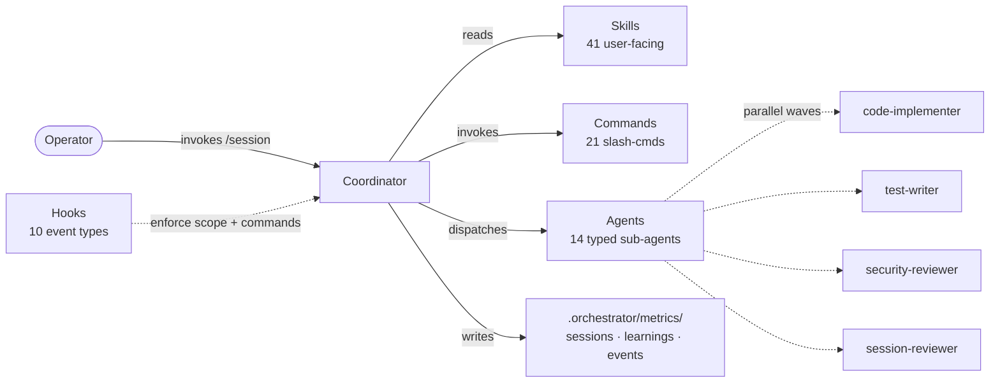

# Components & Reference

Detailed component inventory and architecture reference for Session Orchestrator. The [README](../README.md) keeps the landing page lean; the full inventory lives here.

## Repository anatomy

## Skills (41 user-facing)

- **Lifecycle:** `session-start`, `session-plan`, `wave-executor`, `session-end`, `quality-gates`, `using-orchestrator`
- **Authoring:** `skill-creator`, `mcp-builder`, `hook-development`, `frontmatter-guard`
- **Planning & discovery:** `plan`, `discovery`, `repo-audit`, `brainstorm`, `write-executable-plan`, `debug`, `claude-md-drift-check`, `grill`
- **Architecture:** `architecture`, `domain-model`, `ubiquitous-language`
- **Cross-session:** `evolve`, `convergence-monitoring`, `memory-cleanup`, `sunset-review`
- **Vault & docs:** `vault-sync`, `vault-mirror`, `daily`, `docs-orchestrator`
- **Ecosystem:** `bootstrap`, `gitlab-ops`, `gitlab-portfolio`, `ecosystem-health`, `mode-selector`, `autopilot`, `dispatcher`
- **Testing:** `test-runner`, `playwright-driver`, `peekaboo-driver`
- **Content review:** `persona-panel`
- **Visualization:** `tmux-layout` (opt-in operator side-channel — [ADR-0007](adr/0007-tmux-visualization-substrate.md))

## Commands (21)

`/session`, `/go`, `/close`, `/discovery`, `/plan`, `/evolve`, `/bootstrap`, `/harness-audit`, `/autopilot`, `/autopilot-multi`, `/repo-audit`, `/test`, `/memory-cleanup`, `/portfolio`, `/brainstorm`, `/debug`, `/persona-panel`, `/grill`, `/sunset-review`, `/templates-ack`, `/dispatcher`.

## Agents (14 typed sub-agents)

`code-implementer`, `test-writer`, `ui-developer`, `db-specialist`, `security-reviewer`, `session-reviewer`, `docs-writer`, `architect-reviewer`, `qa-strategist`, `analyst`, `ux-evaluator`, `dialectic-deriver`, `memory-proposal-collector`, `skill-applied-judge`.

Custom agents live in `agents/` (plugin) or `.claude/agents/` (project) as Markdown with YAML frontmatter. The authoring spec — required fields, body conventions, validation commands — is in [`agents/AGENTS.md`](../agents/AGENTS.md), following the canonical [code.claude.com/sub-agents](https://code.claude.com/docs/en/sub-agents) contract.

## Hook event types (10)

`SessionStart` (banner + init), `SessionEnd` (close events), `PreToolUse/Edit|Write` (scope enforcement), `PreToolUse/Bash` (destructive-command guard + enforce-commands + templates-first + staging-fence + memory-propose audit), `PostToolUse` (edit validation + opt-in frontend-slop detection + loop-guard), `Stop` (session events), `SubagentStop` (telemetry), `PostToolUseFailure` (corrective context), `PostToolBatch` (wave signal + operator-steer), `SubagentStart` (telemetry), `CwdChanged` (cwd-change record).

## Other surfaces

- **Output Styles (3):** `session-report`, `wave-summary`, `finding-report`.
- **Policy & rules:** `.orchestrator/policy/blocked-commands.json` (destructive-command rules); `.claude/rules/parallel-sessions.md` (PSA-001..PSA-004).
- **Codex:** `.codex-plugin/plugin.json` (manifest), compatibility config, agent role definitions.
- **Pi:** `package.json` `pi` manifest, `pi/extensions/session-orchestrator.ts` bridge, `hooks/hooks-pi.json`, `scripts/pi-install.mjs`.
- **Scripts:** deterministic CLI tools (parse-config, run-quality-gate, validate-wave-scope, validate-plugin, token-audit, autopilot) plus shared lib under `scripts/lib/*.mjs`, all covered by the vitest suite.

## `/harness-audit` — Anthropic large-codebase rubric

`scripts/harness-audit.mjs` runs **8 deterministic categories / 33 checks** over a repo and emits `.orchestrator/metrics/audit.jsonl`. Category 8 ("Large-Codebase Readiness") operationalises Anthropic's [Claude Code large-codebase best-practices](https://claude.com/blog/how-claude-code-works-in-large-codebases-best-practices-and-where-to-start) checklist — layered `CLAUDE.md` (or `AGENTS.md`), codebase-map presence, LSP/code-intelligence wiring, scoped test/lint commands, `permissions.deny`, and root-file leanness — as scored signals you can run on yourself and on consumer repos. These checks are intentionally orthogonal to repo-audit's baseline-compliance pass/fail; both surfaces ship.

## Comparison vs. maestro-orchestrate

Both [`maestro-orchestrate`](https://github.com/josstei/maestro-orchestrate) and session-orchestrator coordinate multi-agent work in long-running AI coding sessions. They differ in scope and execution model:

| Axis | session-orchestrator | maestro-orchestrate |
|---|---|---|
| Execution model | 5 typed waves (Discovery → Impl-Core → Impl-Polish → Quality → Finalization) with inter-wave quality gates and confidence-scored session-reviewer | 4-phase sequential model with parallel subagents |
| Runtime coverage | Claude Code + Codex CLI + Cursor IDE + Pi (4) | Gemini CLI + Claude Code + Codex + Qwen Code (4) |
| VCS integration | GitLab + GitHub (auto-detected); hook events + commands wire to both | Runtime-agnostic; VCS work delegated to user |
| Cross-session learning | Confidence-scored entries surfaced at session-start; opt-in `/evolve` review | Session archival without explicit learning extraction |
| Specialist agents | 14 typed agents | 39 specialist agents across design/impl/review/debugging/security/compliance |

The two plugins are complementary rather than competing: session-orchestrator focuses on a single wave-based lifecycle with VCS + learning integration, while maestro-orchestrate optimises for multi-runtime parallel specialist delivery.
