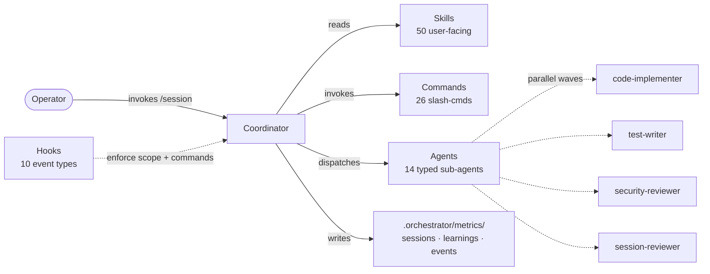

# Components & Reference

Detailed component inventory and architecture reference for Session Orchestrator. The [README](../README.md) keeps the landing page lean; the full inventory lives here.

## Repository anatomy

```mermaid
flowchart LR
    USER([Operator]) -->|invokes /session| COORD[Coordinator]
    COORD -->|reads| SK[Skills<br/>50 user-facing]
    COORD -->|invokes| CMD[Commands<br/>26 slash-cmds]
    COORD -->|dispatches| AG[Agents<br/>14 typed sub-agents]
    AG -.->|parallel waves| W1[code-implementer]
    AG -.-> W2[test-writer]
    AG -.-> W3[security-reviewer]
    AG -.-> W4[session-reviewer]
    HOOK[Hooks<br/>10 event types] -.->|enforce scope + commands| COORD
    COORD -->|writes| METRIC[.orchestrator/metrics/<br/>sessions · learnings · events]
```

## Skills (50 user-facing)

- **Lifecycle:** `session-start`, `session-plan`, `wave-executor`, `session-end`, `quality-gates`, `using-orchestrator`
- **Authoring:** `mcp-builder`, `hook-development`, `frontmatter-guard`
- **Planning & discovery:** `plan`, `discovery`, `repo-audit`, `brainstorm`, `write-executable-plan`, `debug`, `claude-md-drift-check`, `grill`
- **Architecture:** `architecture` (carries the former `domain-model` grilling flow plus the `CONTEXT.md`/ADR formats under `skills/architecture/references/`)
- **Cross-session:** `evolve`, `convergence-monitoring`, `memory-cleanup`, `reconcile`, `sunset-review`, `eval`
- **Vault & docs:** `vault-sync`, `vault-mirror`, `docs-orchestrator`
- **Ecosystem:** `bootstrap`, `gitlab-ops`, `gitlab-portfolio`, `ecosystem-health`, `mode-selector`, `autopilot`, `dispatcher`, `remote-offload`, `spinout`, `npm-publish`
- **Testing:** `test-runner`, `playwright-driver`, `peekaboo-driver`, `ux-grill`
- **Content review:** `persona-panel`
- **Operator ergonomics:** `eli5` (plain-language restatement of the last answer)
- **Visualization:** `tmux-layout` (opt-in operator side-channel — [ADR-0007](adr/0007-tmux-visualization-substrate.md))

## Commands (26)

A slash command has exactly ONE definition. 24 are skills with explicit `user-invocable: true` in `skills/<name>/SKILL.md` (the same file the model dispatches; `argument-hint` and `disable-model-invocation` live there too), and 2 are plain `commands/*.md` files without a same-named skill. Claude Code registers both shapes as `/session-orchestrator:<name>`, so a name that exists as both a command file and a user-invocable skill is listed twice in the `/` picker — `tests/commands/headless-bare-command-availability.test.mjs` forbids that twin.

- **Skills (24):** `/autopilot`, `/bootstrap`, `/brainstorm`, `/close`, `/debug`, `/discovery`, `/dispatcher`, `/eli5`, `/eval`, `/evolve`, `/go`, `/grill`, `/harness-audit`, `/memory-cleanup`, `/persona-panel`, `/plan`, `/portfolio`, `/reconcile`, `/release`, `/repo-audit`, `/spinout`, `/sunset-review`, `/test`, `/ux-grill`.
- **Command files (2):** `/session` (its skill is `session-start`) and `/templates-ack` (an in-session hook bypass with no skill body).

Under `claude -p`, `/session` and `/plan` are reserved terminal built-ins; use `/session-orchestrator:session` and `/session-orchestrator:plan` there.

## Agents (14 typed sub-agents)

`code-implementer`, `test-writer`, `ui-developer`, `db-specialist`, `security-reviewer`, `session-reviewer`, `docs-writer`, `architect-reviewer`, `qa-strategist`, `analyst`, `ux-evaluator`, `dialectic-deriver`, `skill-applied-judge`, `eval-judge`.

Custom agents live in `agents/` (plugin) or `.claude/agents/` (project) as Markdown with YAML frontmatter. The authoring spec — required fields, body conventions, validation commands — is in [`docs/agent-authoring.md`](./agent-authoring.md), following the canonical [code.claude.com/sub-agents](https://code.claude.com/docs/en/sub-agents) contract.

## Hook event types (10)

The full Claude wiring uses: `SessionStart` (banner + init), `SessionEnd` (close events), `PreToolUse/Edit|Write` (scope enforcement), `PreToolUse/Bash` (destructive-command guard + enforce-commands + templates-first + staging-fence + memory-propose audit), `PostToolUse` (edit validation + opt-in frontend-slop detection + loop-guard), `Stop` (session events), `SubagentStop` (telemetry), `PostToolUseFailure` (corrective context), `PostToolBatch` (wave signal + operator-steer), `SubagentStart` (telemetry), `CwdChanged` (cwd-change record).

Codex uses the curated six-event project subset `SessionStart`, `PreToolUse`, `PostToolUse`, `SubagentStart`, `SubagentStop`, and `Stop`. Claude-only events are not exposed there, and Claude Edit/Write handlers remain unwired until a real adapter translates Codex's canonical `apply_patch` payload. The manifest uses native `${PLUGIN_ROOT}` while exporting `CODEX_PLUGIN_ROOT` plus `SO_PLATFORM=codex` for shared compatibility code.

## Other surfaces

- **Output Styles (3):** `session-report`, `wave-summary`, `finding-report`.
- **Policy & rules:** `.orchestrator/policy/blocked-commands.json` (destructive-command rules); `.claude/rules/parallel-sessions.md` (PSA-001..PSA-004).
- **Destructive-command guard.** On Claude Code, the active `hooks/pre-bash-destructive-guard.mjs` applies `.orchestrator/policy/blocked-commands.json` in the main session and in subagent waves. The policy has 12 blocking rules (`git reset --hard`, `rm -rf`, `git push --force`, deletion of `.orchestrator/metrics/**`, and more) and 4 warning rules. Cursor and Pi use event bridges with documented limits; Codex does not enforce this guard. Scope `enforcement: warn` or `off` does not change the separate destructive-command policy — see [Platform support](../README.md#platform-support). Where the hook is active, bypass it per session only for intentional maintenance by setting `allow-destructive-ops: true` in Session Config. The rule source of truth is [`.claude/rules/parallel-sessions.md`](https://github.com/Kanevry/session-orchestrator/blob/main/.claude/rules/parallel-sessions.md) (PSA-003), vendored to consumer repos via `/bootstrap`.
- **Import probe.** `hooks/post-edit-import-probe.mjs` (PostToolUse on `Edit`/`Write`/`MultiEdit`) guards the other direction: a hook-reachable helper saved in a broken intermediate state makes *every* Bash/Edit/Write call fail with an internal hook error, host-wide, for every session sharing the working copy. Right after such a file is saved the probe runs ESLint `no-undef` on it (plus a child-process `import()` for `scripts/lib/**`) and reports the blast radius; it never blocks and always exits 0. It only fires for files listed in the committed allowlist [`hooks/_lib/hook-import-set.json`](../hooks/_lib/hook-import-set.json), regenerated by `node scripts/generate-hook-import-set.mjs`. Kill switch: `SO_DISABLED_HOOKS=post-edit-import-probe`.
- **Process-group kill + orphan reaper.** Both quality-gate paths spawn their commands `detached: true`, so the whole process GROUP is killed on timeout (SIGTERM → grace → SIGKILL, exit 124) instead of only the shell — the shell's own children used to be reparented to PID 1 and keep running. Every gate process this repo starts is recorded in `.orchestrator/runtime/gate-processes.jsonl`; `hooks/post-tool-batch-wave-signal.mjs` and `hooks/on-stop.mjs` trigger a throttled, detached orphan scan that reaps only what that register claims. Ships inert (`reaper.enabled: false`, `reaper.mode: report`) until its firing rate is measured — rule [`.claude/rules/host-resources.md`](../.claude/rules/host-resources.md) § HR-107, rationale [ADR-0015](adr/0015-process-group-kill-and-orphan-reaper.md), audit trail `.orchestrator/metrics/reaper-audit.jsonl`.
- **Plugin validators.** `scripts/validate-plugin.mjs` runs the validator set under `scripts/lib/validate/*.mjs` (48 modules on disk, measured 2026-09-22 with `ls scripts/lib/validate/*.mjs | wc -l`); a failing BLOCKING validator fails the run. Newest blocking member: `check-hook-entry-guards.mjs` — an AST oracle over every hook registered in the four hook manifests, flagging a missing entry guard or a top-level profile exit, either of which makes an imported hook module execute its whole program.
- **Codex:** `.codex-plugin/plugin.json` (tracked `+codex.<UTC timestamp>` version), generated command and skill entrypoints under `.codex-plugin/skills/`, compatibility config, agent role definitions, and the public marketplace/add/list lifecycle implemented by `scripts/codex-install.mjs`. `scripts/generate-codex-skills.mjs` produces the name union with commands taking precedence; [Codex usage](codex-setup.md#usage) explains selection. Every installer run refreshes via `plugin add`; hook trust remains an operator decision in a fresh task through `/hooks`.
- **Cursor:** `.cursor-plugin/plugin.json` registers canonical skills and `.mcp.json` using Cursor's native manifest format. Additional native component discovery is explicitly disabled; `scripts/cursor-install.mjs` supplies the existing command and hook adapters. The former standard root manifest was moved to prevent [Codex manifest interception](codex-setup.md#manifest-compatibility).
- **Pi:** `package.json` `pi` manifest, `pi/extensions/session-orchestrator.ts` bridge, `hooks/hooks-pi.json`, `scripts/pi-install.mjs`.
- **Portable cross-harness surface (generated, never hand-edited):** root `AGENTS.md` (byte-identical copy of `CLAUDE.md`) and `.agents/skills/<name>/SKILL.md` — mirrors carrying only spec-legal frontmatter plus a pointer body. These two surfaces are written by `scripts/generate-agents-skills.mjs` and drift-checked via its `--check` form inside `scripts/validate-plugin.mjs`. Native plugin manifests are maintained separately, with versions updated by `scripts/release.mjs`.
- **Scripts:** deterministic CLI tools (parse-config, run-quality-gate, validate-wave-scope, validate-plugin, token-audit, autopilot, session-shape) plus shared lib under `scripts/lib/*.mjs` — e.g. `session-shape.mjs` (the one wave-shape resolver for `/session` mode + `--profile`), `maintenance-due-banner.mjs` (the single session-start probe for the whole maintenance loop), `session-end/tail-runner.mjs` (the mechanical apply-half of Phase 3.6.4's Expired-Learnings Sweep), `issue-budget-reconcile.mjs` (close-time recorded-vs-charged cross-check), `telemetry/pricing.mjs` (per-model USD-per-token rates for cost estimation), `process-group.mjs` (the one `spawnInGroup`/`killProcessGroup` primitive both quality-gate paths use) and `orphan-reaper.mjs` (the pure `decideReapCandidates` decision plus `runOrphanScan`) — all covered by the vitest suite. Standalone CLIs added in the same cycle: `scripts/check-sessions-integrity.mjs` (validates the just-written `sessions.jsonl` record against the schema AND vault-mirror's real render path; exit 0/1/2). Config parsers live beside their block: `scripts/lib/config/reaper.mjs`, `scripts/lib/config/gate.mjs`.

## `/harness-audit` — Anthropic large-codebase rubric

`scripts/harness-audit.mjs` runs **9 deterministic categories / 38 checks** over a repo and emits `.orchestrator/metrics/audit.jsonl`. Category 8 ("Large-Codebase Readiness") operationalises Anthropic's [Claude Code large-codebase best-practices](https://claude.com/blog/how-claude-code-works-in-large-codebases-best-practices-and-where-to-start) checklist — layered `CLAUDE.md` (or `AGENTS.md`), codebase-map presence, LSP/code-intelligence wiring, scoped test/lint commands, `permissions.deny`, and root-file leanness — as scored signals you can run on yourself and on consumer repos. Category 9 ("Skill-Health Surfacing") surfaces the #648 per-skill health pipeline — telemetry hygiene, scorer wiring, and an advisory-only verdict tally that never affects points; non-adoption always scores full points. These checks are intentionally orthogonal to repo-audit's baseline-compliance pass/fail; both surfaces ship.

## Comparisons

Moved here from the README so that a claim about another project can carry its measurement next to it. Every row below names when and how it was measured; rows that could not be measured were **removed rather than softened** — an unverifiable comparison row is worse than none.

### vs. `open-gsd/gsd-core`

Surface counts measured 2026-09-06 by this repo's 360° ecosystem probe (`docs/audits/2026-09-06-360-audit/w1/d11-github-overlap.md`); session-orchestrator's own counts measured the same day with the commands listed in the [README](../README.md#what-you-get).

| Axis | session-orchestrator | `open-gsd/gsd-core` |
|---|---|---|
| Commands / skills / agents | 26 / 50 / 14 | 70 / 71 / 35 |
| Hook guards | 27 hook files, 10 event types | 28 hooks, incl. write / read / prompt / workflow / secret-read / agent-isolation / worktree-path guards |
| Cross-session learning | `/evolve` + confidence-scored `learnings.jsonl`; reconcile turns eligible learnings into PROPOSED rules an operator approves one by one | `gsd-extract-learnings`, `gsd-mempalace-*` |
| Harness coverage | Claude Code, Codex CLI, Cursor IDE, Pi (4) | 44 `capabilities/` directories (pi, hermes, kimi, windsurf, opencode, ollama, …) |
| Install | marketplace / clone + installer script per harness | `npx @opengsd/gsd-core@latest` |

**Two README rows were deleted here, not carried over.** The old README comparison table claimed "Scope and command enforcement hooks → Other orchestrators: None" and "Cross-session learning → Other orchestrators: None". Both are **false**: gsd-core ships 28 guard hooks and two learning subsystems (measurement above). Two further rows — "VCS integration → usually GitHub only" and "Circuit breaker → Partial" — were removed because no measurement of any named project backs them.

**What is NOT established.** Whether gsd-core's session lock covers the *operator-session* axis (multiple concurrent human sessions in one working copy) is an **open question** — the probe counted 14 code hits in its hooks without reading them. Until that is read, treat the operator-session axis as the plausible distinguishing surface rather than a proven one. The surfaces this repo can point at concretely are: a heartbeat session lock plus peer-scope manifests and the PSA rule set (`.claude/rules/parallel-sessions.md`); owner privacy by construction (`owner.yaml` outside every repo plus a leakage scanner with name redaction); rules derived from this repo's own measured telemetry; Obsidian vault mirroring; and dual GitLab + GitHub auto-detection.

### vs. `maestro-orchestrate`

Both [`maestro-orchestrate`](https://github.com/josstei/maestro-orchestrate) and session-orchestrator coordinate multi-agent work in long-running AI coding sessions. They differ in scope and execution model:

| Axis | session-orchestrator | maestro-orchestrate |
|---|---|---|
| Execution model | typed waves resolved from the session mode by `scripts/session-shape.mjs` (housekeeping 1 · feature 3 · deep 5 · ultradeep 7) with inter-wave quality gates and confidence-scored session-reviewer | 4-phase sequential model with parallel subagents |
| Runtime coverage | Claude Code + Codex CLI + Cursor IDE + Pi (4) | Gemini CLI + Claude Code + Codex + Qwen Code (4) |
| VCS integration | GitLab + GitHub (auto-detected); hook events + commands wire to both | Runtime-agnostic; VCS work delegated to user |
| Cross-session learning | Confidence-scored entries surfaced at session-start; opt-in `/evolve` review | Session archival without explicit learning extraction |
| Specialist agents | 14 typed agents | 39 specialist agents across design/impl/review/debugging/security/compliance |

The two plugins are complementary rather than competing: session-orchestrator focuses on a single wave-based lifecycle with VCS + learning integration, while maestro-orchestrate optimises for multi-runtime parallel specialist delivery.
